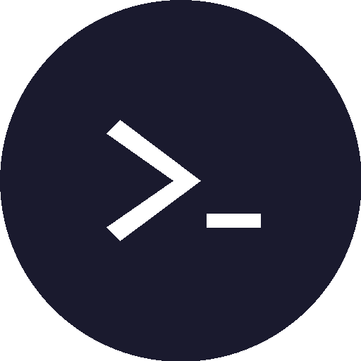
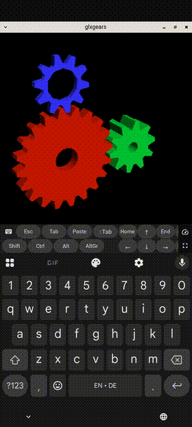

<p align="center">
  
</p>

<h1 align="center">Haven</h1>

<p align="center">
  Free SSH, VNC, RDP, SFTP &amp; cloud storage client for Android
</p>

> *"Haven is an interesting vibe coding experiment. Let's see what comes out of it."* — DBP

<p align="center">
  <a href="https://github.com/GlassOnTin/Haven/releases/latest"></a>
  <a href="https://github.com/GlassOnTin/Haven/actions/workflows/ci.yml"></a>
  <a href="LICENSE"></a>
  <a href="https://ko-fi.com/glassontin"></a>
</p>

<p align="center">
  <a href="https://github.com/GlassOnTin/Haven/releases/latest">GitHub Releases</a> &bull;
  <a href="https://f-droid.org/en/packages/sh.haven.app">F-Droid</a>
</p>

---

<p align="center">
  
  &nbsp;
  
  &nbsp;
  
  &nbsp;
  
  &nbsp;
  
  &nbsp;
  
</p>

---

## Features

**Terminal** — VT100/xterm emulator with multi-tab sessions, [Mosh](https://mosh.org) (Mobile Shell) for roaming connections and [Eternal Terminal](https://eternalterminal.dev) (ET) for persistent sessions — both with pure Kotlin protocol implementations (no native binaries), tmux/zellij/screen auto-attach with **session restore** (remembers previously open sessions and offers to reopen them), tab reordering via long-press menu, color-coded tabs matching connection profiles, mouse mode for TUI apps, configurable keyboard toolbar (Esc, Tab, Ctrl, Alt, AltGr, arrows with key repeat), text selection with copy and Open URL, configurable font size, and six color schemes.

**Desktop (VNC)** — Remote desktop viewer with RFB 3.8 protocol support. Pinch-to-zoom, two-finger pan and scroll, single-finger drag for window management, soft keyboard with X11 KeySym mapping. Fullscreen mode with NoMachine-style corner hotspot for session controls. Connect directly or tunnel through SSH. Supports Raw, CopyRect, RRE, Hextile, and ZLib encodings.

**Native Wayland Desktop** — GPU-accelerated Wayland compositor (labwc) running natively inside Haven. Full interactive terminal with keyboard input, mouse interaction, server-side window decorations, pinch-to-zoom, and fullscreen mode with corner overlay menu. The GPU pipeline renders via GLES2 on the device's GPU (AHardwareBuffer allocator, ASurfaceControl zero-copy presentation). Native Wayland clients can render 3D content — includes a built-in GLES2 benchmark (rotating lit cube at 60fps on Mali-G715). Configurable shell (/bin/sh, bash, zsh, fish) and shared keyboard toolbar (Esc, Tab, Ctrl, Alt, arrows, function keys). External Wayland clients can connect via Shizuku (symlinks the socket to `/data/local/tmp/haven-wayland/`). No root required — runs in PRoot with an Alpine Linux rootfs.

**Local Desktop (X11)** — one-tap desktop running on-device via PRoot. Choose from Xfce4 or Openbox with X11/Xvnc. For Wayland, use the Native Wayland Desktop above.

**Desktop (RDP)** — Remote Desktop Protocol client built on [IronRDP](https://github.com/Devolutions/IronRDP) via UniFFI Kotlin bindings. Connects to Windows Remote Desktop, xrdp (Linux), and GNOME Remote Desktop. Pinch-to-zoom, pan, keyboard with scancode mapping, mouse input. SSH tunnel support with auto-connect through saved SSH profiles. Saved connection profiles with optional stored password.

**Files** — Unified file browser with SFTP, SMB, and cloud storage tabs. Browse remote directories, upload files or entire folders, download, delete, create directories, copy path, toggle hidden files, sort by name/size/date. **Cross-filesystem copy/move** — copy files between any backends (e.g. Google Drive → SFTP server) with clipboard model: long-press → Copy/Cut, switch tab, Paste. Conflict resolution (skip/replace) for existing files. Path preserved when switching between tabs.

**Cloud Storage** — Browse, upload, download, and manage files on 60+ cloud providers via [rclone](https://rclone.org) — Google Drive, Dropbox, OneDrive, Amazon S3, Backblaze B2, and more. OAuth authentication with automatic browser flow. Server-side copy between cloud remotes (no temp file needed).

**SSH Keys** — Generate Ed25519, RSA, and ECDSA keys on-device. Import keys from file (PEM/OpenSSH/Dropbear format) or paste from clipboard. One-tap public key copy and deploy key dialog for `authorized_keys` setup. Assign specific keys to individual connections.

**SMB** — Browse Windows/Samba file shares with optional SSH tunneling for secure access over the internet.

**Connections** — Saved profiles with transport selection (SSH, Mosh, Eternal Terminal, VNC, RDP, SMB, Cloud Storage, Reticulum), host key TOFU verification, fingerprint change detection, auto-reconnect with backoff, password fallback, local/remote port forwarding (-L/-R), ProxyJump multi-hop tunneling (-J) with tree view, SOCKS5/SOCKS4/HTTP proxy support (Tor .onion compatible), and RDP-over-SSH tunnel profiles.

**Local Shell (PRoot)** — Run a real Linux terminal directly on your phone, no root required. Select "Local Shell (PRoot)" when creating a connection and Haven downloads a minimal [Alpine Linux](https://alpinelinux.org/) rootfs (~4 MB) on first use. From there you have a full `apk` package manager — install Python, Node.js, git, build tools, or anything in Alpine's [package repository](https://pkgs.alpinelinux.org/packages).

PRoot works by intercepting system calls in userspace (no kernel modifications), so it runs on **any unrooted Android device**. It does not require or use root access — the name "PRoot" stands for "ptrace-based root", meaning it *emulates* a root filesystem without actual superuser privileges. Think of it as a lightweight container that runs entirely within Haven's app sandbox.

How it compares to alternatives:
- **Rooted phones (Magisk/su)**: Root gives full system access. PRoot is sandboxed — it can't modify your system, but it also doesn't need root to work.
- **[Android Terminal VM](https://developer.android.com/studio/run/managing-avds)** (Pixel 8+): Google's official Linux VM runs a full kernel via [pKVM](https://source.android.com/docs/core/virtualization). It's more capable but only available on Pixel 8 and newer. PRoot runs on any device back to Android 8. Haven can SSH into an Android Terminal VM if you have one — see the connection settings.
- **[Termux](https://termux.dev/)**: A standalone terminal emulator with its own package ecosystem. PRoot is lighter (4 MB vs ~100 MB) and integrated into Haven alongside your SSH/cloud sessions.

See [PRoot documentation](https://proot-me.github.io/) for technical details.

**Reticulum** — Connect over [Reticulum](https://reticulum.network) mesh networks via [rnsh](https://github.com/acehoss/rnsh) or [Sideband](https://github.com/markqvist/Sideband) with announce-based destination discovery and hop count.

**Security** — Biometric app lock with configurable timeout (immediate/30s/1m/5m/never), no telemetry or analytics, local storage only. See [PRIVACY_POLICY.md](PRIVACY_POLICY.md).

<details>
<summary><strong>OSC escape sequences</strong></summary>

Remote programs can interact with Android through standard terminal escape sequences:

| OSC | Function | Example |
|-----|----------|---------|
| 52 | Set clipboard | `printf '\e]52;c;%s\a' "$(echo -n text \| base64)"` |
| 8 | Hyperlinks | `printf '\e]8;;https://example.com\aClick\e]8;;\a'` |
| 9 | Notification | `printf '\e]9;Build complete\a'` |
| 777 | Notification (with title) | `printf '\e]777;notify;CI;Pipeline green\a'` |
| 7 | Working directory | `printf '\e]7;file:///home/user\a'` |

Notifications appear as a toast in the foreground or as an Android notification in the background.

</details>

## Languages

Haven is available in 11 languages: English, Chinese (simplified), Spanish, Hindi, Arabic (with RTL support), Portuguese, Bengali, Russian, Japanese, French, and German. The UI automatically switches to the device language. Community translation contributions welcome.

## Install

| Channel | |
|---|---|
| [GitHub Releases](https://github.com/GlassOnTin/Haven/releases/latest) | Signed APK, all features |
| [F-Droid](https://f-droid.org/en/packages/sh.haven.app) | Built from source, all features |

Both builds are identical — SSH, Mosh, Eternal Terminal, VNC, RDP, SFTP, and Cloud Storage. IronRDP (Rust) is built from source via `cargo-ndk`. rclone (Go) is built from source via `gomobile`.

### Build from source

Requires [Rust](https://rustup.rs/) with Android targets, `cargo-ndk`, [Go](https://go.dev/dl/) 1.26+, and `gomobile`:

```bash
# Rust (for RDP)
rustup target add aarch64-linux-android x86_64-linux-android
cargo install cargo-ndk

# Go (for rclone cloud storage)
go install golang.org/x/mobile/cmd/gomobile@latest
go install golang.org/x/mobile/cmd/gobind@latest

git clone https://github.com/GlassOnTin/Haven.git
cd Haven
./gradlew assembleDebug
```

Output: `app/build/outputs/apk/debug/haven-*-debug.apk`

## Third-party libraries

| Library | Purpose | License |
|---------|---------|---------|
| [rclone](https://rclone.org) | Cloud storage engine (60+ providers) | MIT |
| [IronRDP](https://github.com/Devolutions/IronRDP) | RDP protocol (Rust/UniFFI) | MIT / Apache-2.0 |
| [JSch](https://github.com/mwiede/jsch) | SSH/SFTP protocol | BSD |
| [smbj](https://github.com/hierynomus/smbj) | SMB/CIFS protocol | Apache-2.0 |
| [ConnectBot termlib](https://github.com/connectbot/connectbot) | Terminal emulator | Apache-2.0 |
| [PRoot](https://proot-me.github.io) | Local Linux shell (userspace chroot) | GPL-2.0 |
| [labwc](https://labwc.github.io) | Wayland compositor (native desktop) | GPL-2.0 |
| [wlroots](https://gitlab.freedesktop.org/wlroots/wlroots) | Wayland compositor library | MIT |
| [virglrenderer](https://gitlab.freedesktop.org/virgl/virglrenderer) | GPU virtualization (OpenGL passthrough to PRoot apps) | MIT |
| [Jetpack Compose](https://developer.android.com/jetpack/compose) | UI toolkit | Apache-2.0 |

## License

[GPLv3](LICENSE)
