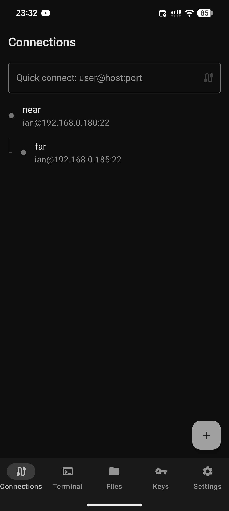
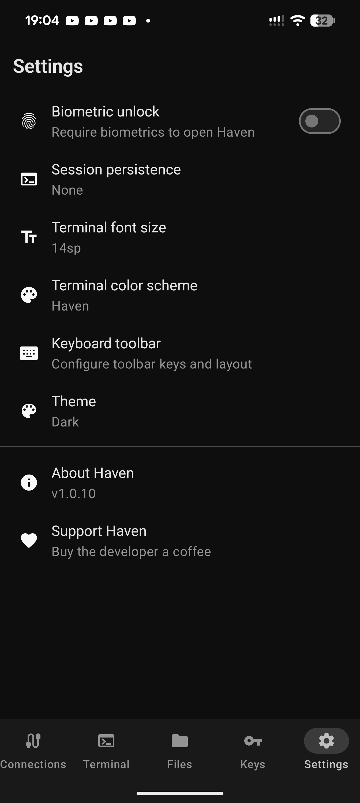

<p align="center">
  
</p>

<h1 align="center">Haven</h1>

<p align="center">
  Free SSH &amp; SFTP client for Android
</p>

<p align="center">
  <a href="https://github.com/GlassOnTin/Haven/releases/latest"></a>
  <a href="https://github.com/GlassOnTin/Haven/actions/workflows/ci.yml"></a>
  <a href="LICENSE"></a>
  <a href="https://ko-fi.com/glassontin"></a>
</p>

<p align="center">
  <a href="https://github.com/GlassOnTin/Haven/releases/latest">GitHub Releases</a> &bull;
  <a href="https://play.google.com/store/apps/details?id=sh.haven.app">Google Play</a> &bull;
  <a href="https://f-droid.org">F-Droid</a>
</p>

---

<p align="center">
  
  &nbsp;&nbsp;
  
  &nbsp;&nbsp;
  
  &nbsp;&nbsp;
  
</p>

---

## Philosophy

Haven is a **transparent terminal**. It never silently injects commands or modifies your shell environment. Session manager auto-attach (tmux, screen, etc.) is the one exception — it's off by default, user-configured, and runs visibly in the terminal. Your remote session belongs to you — Haven just provides the window.

---

## Features

**Terminal** — VT100/xterm emulator with multi-tab sessions, tmux/zellij/screen auto-attach, mouse mode for TUI apps, keyboard toolbar (Esc, Tab, Ctrl, Alt, arrows), text selection with copy and Open URL, configurable font size, and six color schemes.

**SFTP** — Browse remote directories, upload and download files, delete, copy path, toggle hidden files, sort by name/size/date, and multi-server tabs.

**SSH Keys** — Generate Ed25519, RSA, and ECDSA keys on-device. One-tap public key copy and deploy key dialog for `authorized_keys` setup.

**Connections** — Saved profiles with host key TOFU verification, fingerprint change detection, auto-reconnect with backoff, password fallback, local/remote port forwarding (-L/-R), and ProxyJump multi-hop tunneling (-J) with tree view.

**Reticulum** — Connect over [Reticulum](https://reticulum.network) mesh networks via [rnsh](https://github.com/acehoss/rnsh) or [Sideband](https://github.com/markqvist/Sideband) with announce-based destination discovery and hop count.

**Security** — Biometric app lock, no telemetry or analytics, local storage only. See [PRIVACY_POLICY.md](PRIVACY_POLICY.md).

<details>
<summary><strong>OSC escape sequences</strong></summary>

Remote programs can interact with Android through standard terminal escape sequences:

| OSC | Function | Example |
|-----|----------|---------|
| 52 | Set clipboard | `printf '\e]52;c;%s\a' "$(echo -n text \| base64)"` |
| 8 | Hyperlinks | `printf '\e]8;;https://example.com\aClick\e]8;;\a'` |
| 9 | Notification | `printf '\e]9;Build complete\a'` |
| 777 | Notification (with title) | `printf '\e]777;notify;CI;Pipeline green\a'` |
| 7 | Working directory | `printf '\e]7;file:///home/user\a'` |

Notifications appear as a toast in the foreground or as an Android notification in the background.

</details>

## Install

| Channel | |
|---|---|
| [GitHub Releases](https://github.com/GlassOnTin/Haven/releases/latest) | Free, signed APK |
| [Google Play](https://play.google.com/store/apps/details?id=sh.haven.app) | Free, auto-updates |
| [F-Droid](https://f-droid.org) | Free, built from source |

### Build from source

```bash
git clone https://github.com/GlassOnTin/Haven.git
cd Haven
./gradlew assembleDebug
```

Output: `app/build/outputs/apk/debug/haven-*-debug.apk`

## License

[MIT](LICENSE)
